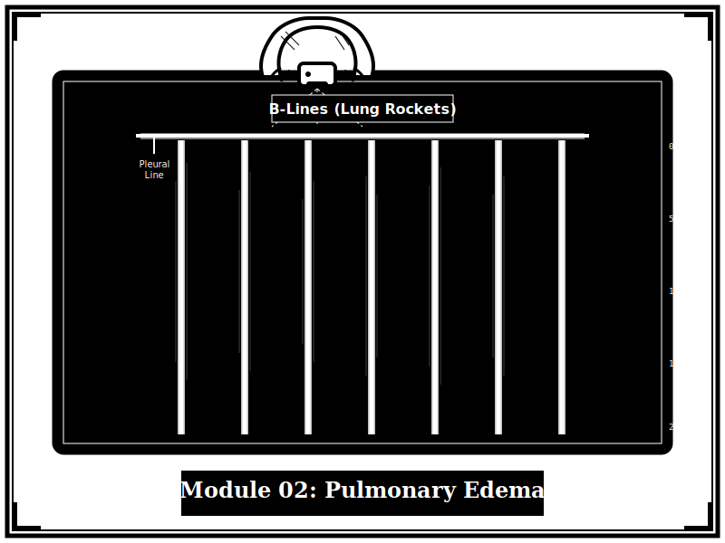
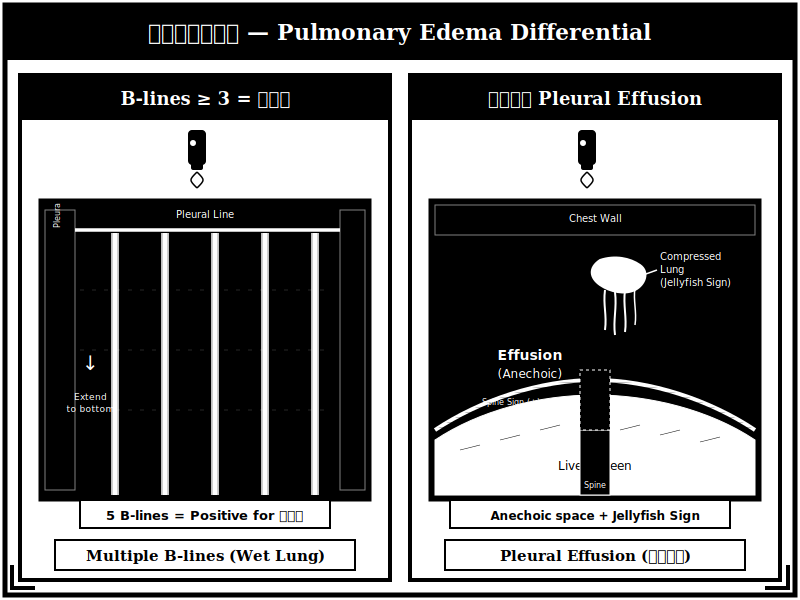

{width=100% fig-alt="肺部超音波顯示 B-lines 的黑白版畫風格插圖"}

## 章節簡介

大葉性肺炎有時與心臟衰竭急性肺水腫難以區分，急性心衰往往合併全身性發炎反應症候群(SIRS)。有賴於 POCUS，這些病患有機會在床邊接受心超檢查，儘早確立診斷。

{width=100% fig-alt="B-lines 與胸腔積液超音波鑑別診斷版畫插圖"}

## 本章課程

1. [教案 5：症狀辨識](05-symptoms.qmd)
2. [教案 6：解剖、生理、病理](06-anatomy.qmd)
3. [教案 7：診斷流程與鑑別診斷](07-diagnosis.qmd)
4. [教案 8：治療與追蹤](08-treatment.qmd)

## 編修醫師

黃冠智 醫師
