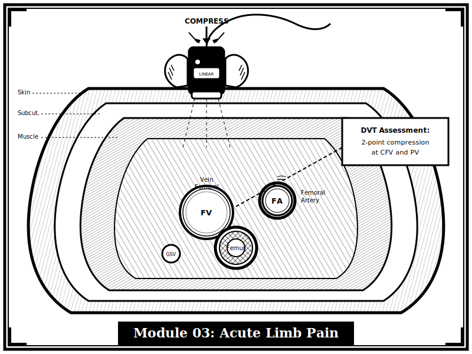
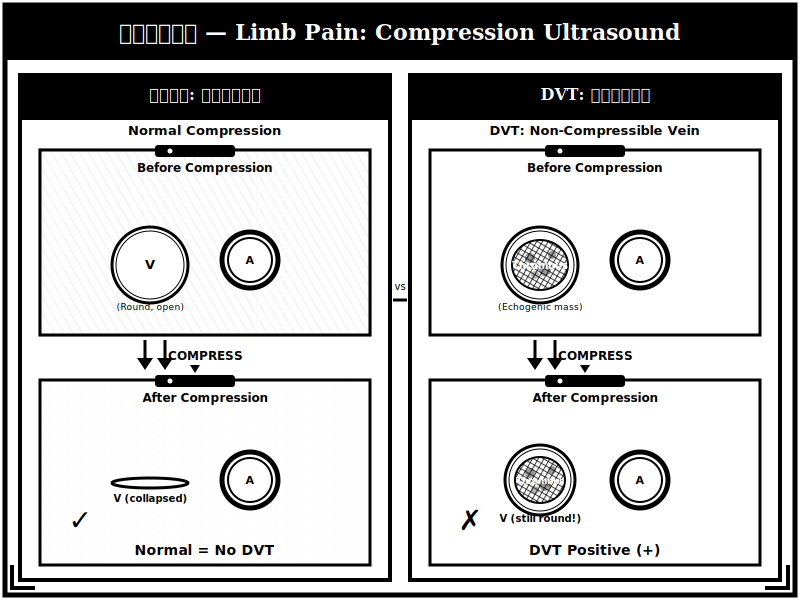

{width=100% fig-alt="下肢血管超音波壓迫試驗的黑白版畫風格插圖"}

## 章節簡介

急性肢端疼痛為老年病患可能發生的急性病症。臨床上需要及時的診斷與轉介，才能避免發生截肢或死亡。

{width=100% fig-alt="DVT 壓迫試驗正常與異常對照版畫插圖"}

## 本章課程

1. [教案 9：症狀辨識](09-symptoms.qmd)
2. [教案 10：解剖、生理、病理](10-anatomy.qmd)
3. [教案 11：診斷流程與鑑別診斷](11-diagnosis.qmd)
4. [教案 12：治療與追蹤](12-treatment.qmd)

## 編修醫師

林姝含 醫師
