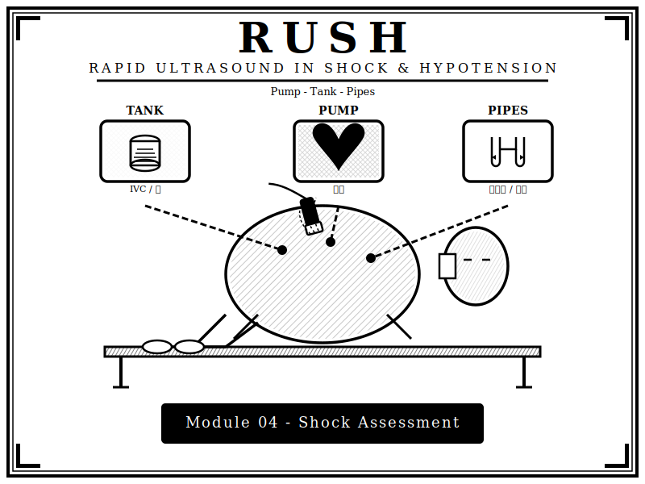
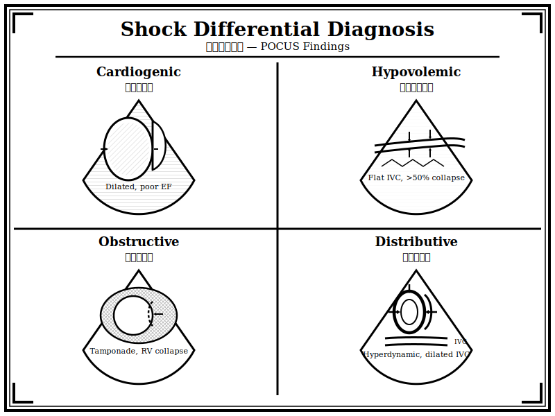

{width=100% fig-alt="RUSH Protocol 超音波評估的黑白版畫風格插圖"}

## 章節簡介

休克是常見的急症，需盡早辨識、鑑別休克原因並進行復甦治療。造成休克的原因可概略分成低容性(hypovolemic)、阻塞性(obstructive)、心因性(cardiogenic)及再分佈性(distributive)休克，不同休克之臨床表現不盡相同，所需之治療也不同。床邊焦點式超音波可協助鑑別診斷以及判斷輸液治療反應。

{width=100% fig-alt="心因性、低血容性、阻塞性、分佈性休克超音波鑑別版畫插圖"}

## 本章課程

1. [教案 13：辨識、病史詢問、理學檢查](13-recognition.qmd)
2. [教案 14：分類、鑑別診斷、病生理](14-classification.qmd)
3. [教案 15：RUSH Protocol](15-rush-protocol.qmd)
4. [教案 16：實際演練與 Megacode](16-megacode.qmd)

## 編修醫師

陳麒心 醫師
