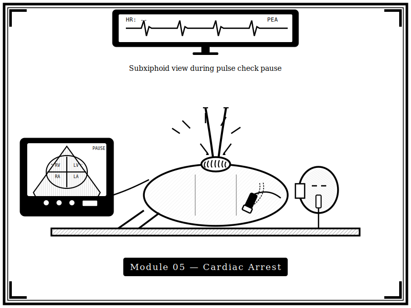
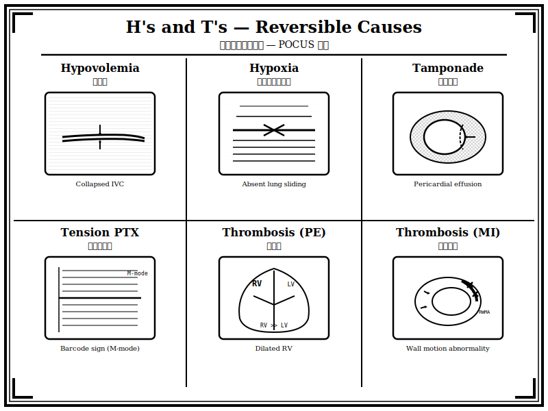

{width=100% fig-alt="CPR 過程中使用超音波評估的黑白版畫風格插圖"}

## 章節簡介

心跳停止的復甦急救除了 ACLS 流程與團隊合作之外，超音波的使用可以輔助鑑別診斷以及治療的導引，因此也是急救過程中很重要的一環。納入超音波於急救復甦的流程之概念如 e-ALS 或 US-CAB 也越來越蓬勃發展。

{width=100% fig-alt="H's and T's 可逆原因超音波鑑別診斷版畫插圖"}

## 本章課程

1. [教案 17：ACLS 急救流程與團隊分工](17-acls.qmd)
2. [教案 18：鑑別診斷與超音波應用](18-differential.qmd)
3. [教案 19：e-ALS US-CAB 流程介紹](19-e-als.qmd)
4. [教案 20：實際演練與 Megacode](20-megacode.qmd)

## 編修醫師

陳麒心 醫師
