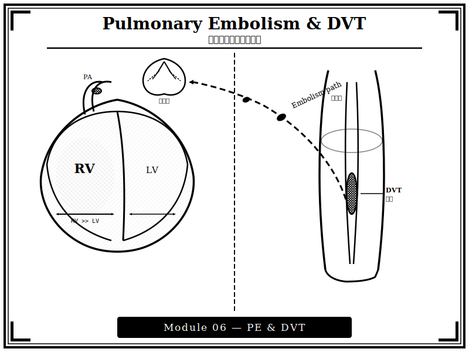
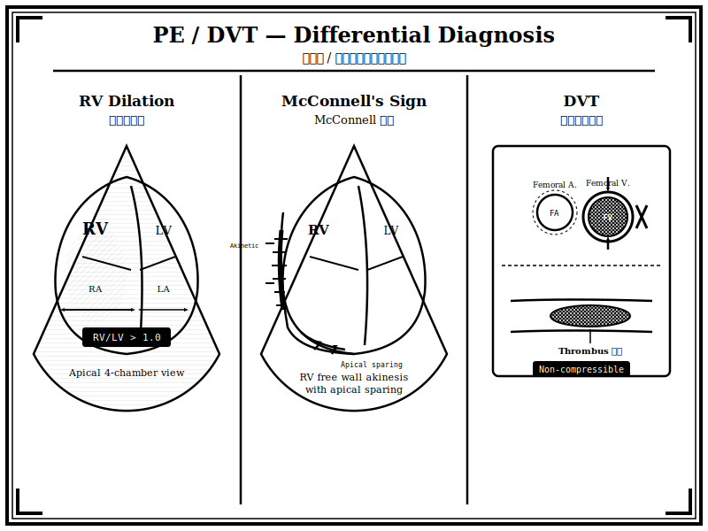

{width=100% fig-alt="右心室擴大與深層靜脈栓塞的黑白版畫風格插圖"}

## 章節簡介

靜脈栓塞與急性肺栓塞是內科病患猝死原因之一，能否及時診斷相當重要。超音波可協助床邊快速評估深層靜脈栓塞與右心功能，在急重症情境中提供關鍵的診斷線索。

{width=100% fig-alt="RV 擴大、McConnell 徵象、DVT 超音波鑑別版畫插圖"}

## 本章課程

1. [教案 21：症狀辨識](21-symptoms.qmd)
2. [教案 22：解剖及生理](22-anatomy.qmd)
3. [教案 23：病理機轉、診斷流程與鑑別診斷](23-diagnosis.qmd)
4. [教案 24：治療](24-treatment.qmd)

## 編修醫師

謝慕揚 醫師、林彥良 醫師
