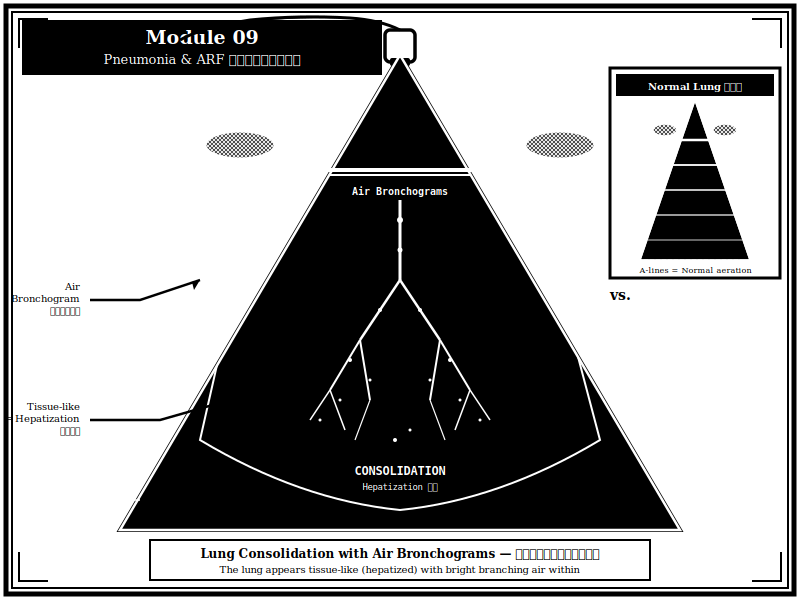

{width=100% fig-alt="肺實質化與 air bronchograms 的黑白版畫風格插圖"}

## 章節簡介

肺炎與急性呼吸衰竭是重症醫學中常見的問題。床邊超音波可以快速評估肺部病變、追蹤治療效果，並協助呼吸器參數調整。

{width=100% fig-alt="肝化徵象、動態氣管支氣管徵、肺搏動超音波鑑別版畫插圖"}

## 本章課程

1. [教案 33：超音波基礎](33-basics.qmd)
2. [教案 34：病理結構](34-pathology.qmd)
3. [教案 35：基本應用](35-basic-application.qmd)
4. [教案 36：進階應用](36-advanced.qmd)

## 編修醫師

多位醫師共同編修
